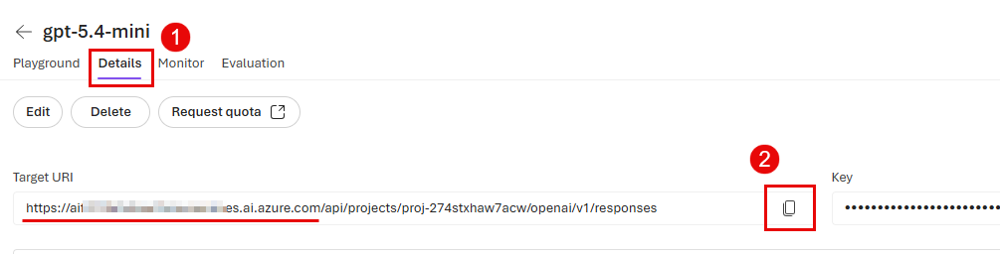

# Task 02 - Configure Azure resources

## Introduction

Now that you have deployed the necessary Azure resources, the next step is to configure these resources.

## Description

In this task, you will configure your Microsoft Foundry project and set up the necessary environment variables for your application.

## Success Criteria

- You have configured your Microsoft Foundry project.
- You have set up the necessary environment variables for your application.

## Learning Resources

- [What is Microsoft Foundry?](https://learn.microsoft.com/azure/ai-foundry/what-is-azure-ai-foundry)
- [Add a new connection to your project](https://learn.microsoft.com/azure/ai-foundry/how-to/connections-add)
- [How to create and configure your storage account for use in Microsoft Foundry Projects](https://learn.microsoft.com/azure/ai-foundry/how-to/evaluations-storage-account)

## Key Tasks

### 01: Create Azure AI model deployments

The Microsoft Foundry project that you deployed as part of the first step is now ready to be configured. You will need to set up the project to use the resources that you deployed in the previous step, as well as selecting the model deployments that you will use.

<strong>Expand this section to view the solution</strong>

Navigate to the [Microsoft Foundry](https://ai.azure.com/) and select the project that you created in the prior task.

From the **Build** menu, select **Models** from the list. Then, select the **Deploy a base model**.

On the **Models** page, enter `phi-4` in the search box and select the **Phi-4** model from the list. Then, select **Confirm** to create a Phi-4 deployment in your project.

Select the **Deploy** button and then choose **Default settings**. On the modal dialog, select **Agree and proceed** to deploy the model.

Repeat this process for **gpt-5.4-mini** and **text-embedding-3-large**. You will have three model deployments in total.

### 02: Grant storage account permissions

In order to integrate your storage account with your Microsoft Foundry project, you will need to grant the project permission to access the storage account. You will also need to grant your own user account permission to access the storage account so that you can run the code in this training.

<strong>Expand this section to view the solution</strong>

In the [Azure portal](https://portal.azure.com/), navigate to the storage account that you connected to your Microsoft Foundry project in the previous step.

Select the **Access control (IAM)** option from the left-hand menu. Then, select the **+ Add** button and choose **Add role assignment**.

Choose the **Storage Blob Data Contributor** role from the **Job function roles** list. Then, select **Members**.

Select the **Managed identity** radio button and then choose **+ Select members**.

In the flyout pane, ensure your subscription is selected. Then, select **Foundry project** from the **Managed identity** drop-down list. Choose the Microsoft Foundry project associated with this training and then select the **Select** button at the bottom of the pane. This must be the project and not the Microsoft Foundry resource itself.

After adding the managed identity, select **User, group, or service principal** from the **Select members** pane. Then, search for your own user account and select it from the list. Finally, select the **Select** button at the bottom of the pane.

When you are back on the **Add role assignment** pane, select the **Review + assign** button twice to grant both the managed identity for your Microsoft Foundry project and your own user account the Storage Blob Data Contributor role on this storage account.

### 03: Configure environment variables

In order to run the code in this training, you will need to set up environment variables for your application. For **local development**, you will create a `.env` file. For **production deployment** to Azure Container Apps, most variables are already configured by the Bicep template, so you only need to set the model-specific endpoints after deploying models in the previous step.

{: .note }
> This training uses **managed identities** (via `DefaultAzureCredential`) to authenticate to all Azure services. You do not need to configure any API keys or connection strings. The only values you need to provide are endpoints, deployment names, and non-secret configuration.

<strong>Expand this section to view the solution</strong>

#### Local development: Create a .env file

Copy the file `src/env_sample.txt` to a new file named `.env` in the same directory. Then, open the `.env` file in a text editor and update the values for each environment variable to match your Azure resources. For any environment variables with pre-filled values, you can leave them as they are unless you explicitly changed the names of the resources during deployment.

You will find the model endpoint variables in the Microsoft Foundry project that you created. To find these values, start by navigating to the **Home** page.

Then, fill in the following.

- `FOUNDRY_ENDPOINT`: Copy the **Project endpoint** box.

For the following variables, navigate to the **Models** menu option from the **Build** menu.

Then, select the appropriate model deployment that you created in the previous step and navigate to the **Details** tab in order to fill in the details below. Start with the **gpt-5.4-mini** deployment.

- `gpt_endpoint`: Copy the **Target URI** box from the **gpt-5.4-mini** deployment and use only the scheme + host portion of the URL (do not include any path such as `/api/...`). It should look like `https://{YOUR_AI_FOUNDRY}.services.ai.azure.com`. In this context, the “Foundry endpoint” refers to this same base host value.

Repeat this process to collect the text-embedding-3-large endpoint details:

- `embedding_endpoint`: Copy the **Target URI** box from the **text-embedding-3-large** deployment. You can copy and paste the entire URL for this endpoint.

Repeat this process to collect the Phi-4 endpoint details, with one major exception.

- `phi_4_endpoint`: Use the following URL, populating the value of your Microsoft Foundry name for `{YOUR_AI_FOUNDRY}`: `https://{YOUR_AI_FOUNDRY}.services.ai.azure.com/models`.

For the storage account name, navigate to the [Azure Portal](https://portal.azure.com/) and open the storage account that you granted permissions to in the prior task.

- `storage_account_name`: Copy the value for **Storage account name** from the **Overview** page.

To fill in the Cosmos DB endpoint, navigate to the Cosmos DB account that you created in the first task.

- `COSMOS_ENDPOINT`: Copy the value for **URI** from the **Overview** page.

For the following variable, navigate to the Application Insights resource that you created in the first task.

- `APPLICATIONINSIGHTS_CONNECTION_STRING`: Copy the value for **Connection string** from the **Overview** page.

{: .note }
> The .env file also includes values for agent IDs. You will use these during Exercise 2 and do not need to modify them.

